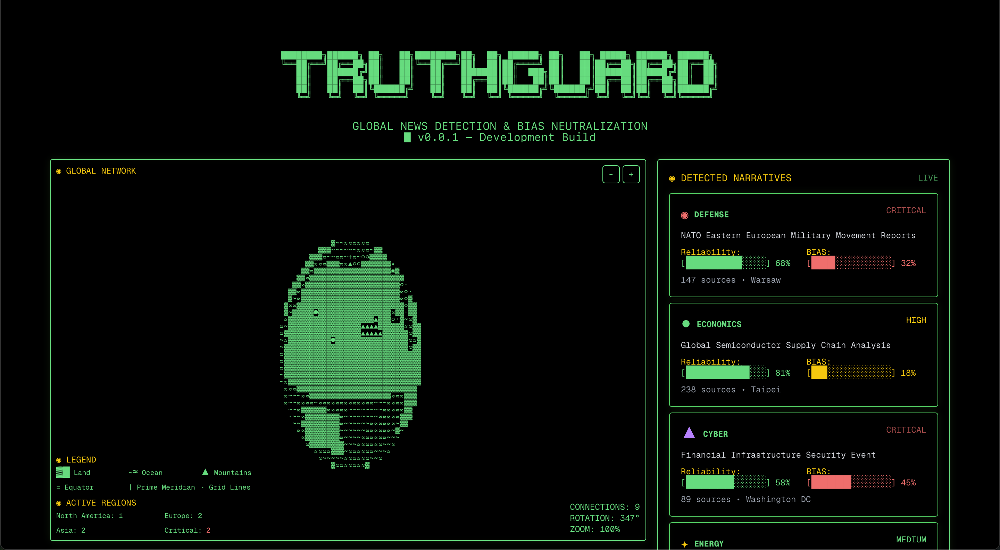

<!-- SHIELDS -->

![Contributors][contributors-shield]
![Stars][stars-shield]
![Issues][issues-shield]

 
<h3 align="center">TruthGuard</h3>

  <strong>by Clickroot</strong> 
  <em>Mission-Critical, By Design.</em>
    
  <code>TruthGuard is the signal filter for the post-truth era.</code>

 

  

## 🛰 What is TruthGuard?

**TruthGuard** is a mission-critical news verification system designed to extract reality from the noise.

It works like a human fact-checker—at machine scale. TruthGuard ingests multiple data sources, synthesizes a mean narrative, and evaluates the **truth level** and **abstracted facts** behind the story. The result is clarity in a time of chaos.

> News is not broken. It’s overloaded.
> TruthGuard is your interpretive layer between *what’s said* and *what’s true*.

 

## 🧠 How It Works

TruthGuard follows a deterministic, multi-stage process:

1. **Ingest Sources**
   Crawls headlines, bodies, and metadata from diverse outlets (APIs, RSS, etc.)

2. **Generate Mean Story**
   Identifies shared semantics and constructs a "consensus narrative"

3. **Abstract Core Facts**
   Extracts claims, actors, causes, and consequences

4. **Truth Level Analysis**
   Compares across-sources for consistency, bias deviation, factual conflicts

5. **Output with Score**
   Returns a structured summary with a confidence level, key facts, and source traceability

 

## 🔐 Why It Matters

The modern information environment is saturated, synthetic, and often adversarial. TruthGuard is not a content filter — it's a **signal detector**.

**Applications:**

* Crisis response dashboards
* Intelligence briefings
* Journalistic vetting
* Election monitoring
* Disinformation mapping

TruthGuard doesn’t tell you what to believe.
It tells you **what was said**, **what’s consistent**, and **what holds up**.

 

## 🛡 Architecture Principles

* 📏 **Deterministic Modeling** — Reproducible outputs from identical inputs
* 🧮 **Mathematical Neutrality** — No political priors baked into the engine
* 🧭 **Traceable Truth** — Every fact has a path

When the truth is scattered, **TruthGuard assembles the map.**

 

## 📡 Contact & Follow

TruthGuard is built by [Clickroot](https://x.com/clickroot).

Follow us at [@Clickroot](https://x.com/clickroot)

 

<a href="#readme-top">⬆️ Back to Top</a>

<!-- SHIELD LINK DEFINITIONS -->

[contributors-shield]: https://img.shields.io/github/contributors/owenCTRL/TruthGuard.svg?style=for-the-badge
[stars-shield]: https://img.shields.io/github/stars/owenCTRL/TruthGuard.svg?style=for-the-badge
[issues-shield]: https://img.shields.io/github/issues/owenCTRL/TruthGuard.svg?style=for-the-badge
